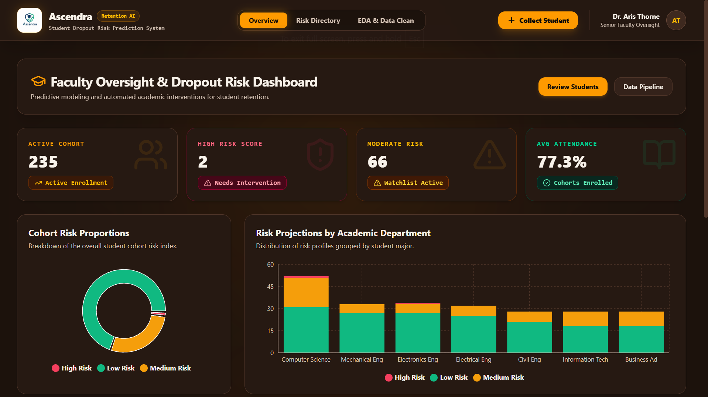
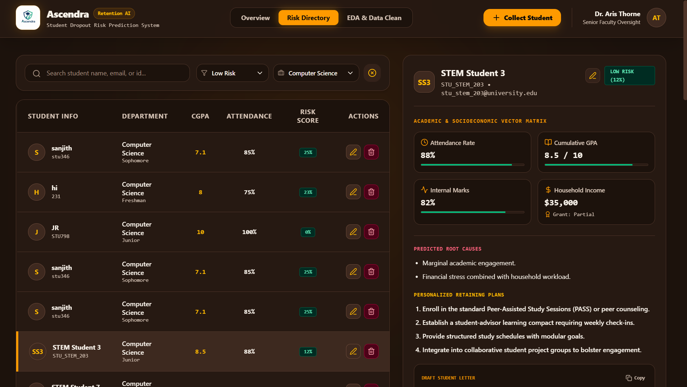
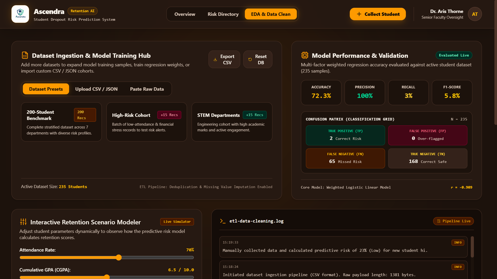

# Ascendra

### Student Dropout Risk Prediction & Early Intervention System

Ascendra is a web-based student retention and dropout-risk management platform designed to help educational institutions identify students who may require additional academic or financial support.

The system brings together student information, academic performance, attendance, socioeconomic factors, risk indicators, and data analytics into a centralized faculty oversight dashboard.

---

## Problem Statement

Student dropout is often influenced by multiple factors such as academic performance, attendance, financial circumstances, and engagement.

Traditional monitoring methods can make it difficult for faculty to identify students who are gradually moving toward a higher-risk situation.

Ascendra aims to provide a centralized platform where faculty can:

- Monitor student risk indicators
- Identify students requiring attention
- Analyze academic and socioeconomic factors
- Explore individual student profiles
- Evaluate risk patterns using data
- Support timely intervention decisions

---

## Key Features

### Faculty Overview Dashboard

The overview dashboard provides a high-level view of the current student cohort, including:

- Total active students
- High-risk students
- Moderate-risk students
- Average attendance
- Risk distribution
- Department-wise risk breakdown
- Student risk indicators

---

### Risk Directory

The Risk Directory provides a searchable view of students and their risk information.

Faculty can:

- Search for students
- Filter student records
- View academic information
- View attendance information
- Examine risk levels
- Inspect individual student profiles
- Identify students requiring intervention

---

### Student Risk Profiles

Each student can be examined through an individual profile containing relevant factors such as:

- Academic performance
- Attendance
- Financial information
- Socioeconomic indicators
- Risk indicators
- Recommended intervention actions

This allows faculty to understand the factors contributing to a student's risk rather than relying only on a single risk label.

---

### Student Data Collection

Ascendra provides a dedicated interface for collecting new student metrics.

The system can capture information related to:

- Academic performance
- Attendance
- Financial circumstances
- Scholarship information
- Student background
- Other relevant retention indicators

---

### EDA & Data Cleaning

The EDA & Data Clean workspace provides tools for working with student datasets.

The current implementation includes:

- Dataset presets
- CSV / JSON dataset import
- Raw data input
- Dataset inspection
- Data cleaning workflow
- Missing-value handling
- Data deduplication
- Exploratory data analysis
- Dataset export

---

## 📸 Application Preview

### Faculty Overview Dashboard

### Risk Directory

### Model Evaluation

### Risk Model Evaluation

Ascendra includes a model evaluation workspace for analyzing the performance of the current risk model.

The interface provides metrics such as:

- Accuracy
- Precision
- Recall
- F1 Score
- Confusion matrix
- True positives
- False positives
- False negatives
- True negatives

The current implementation uses a weighted logistic linear model for risk evaluation.

> **Note:** Model performance metrics shown in the application are based on the current project dataset and configuration and should not be interpreted as production-grade predictive performance without further validation on real-world data.

---

### Interactive Retention Scenario Modeling

The system includes an interactive scenario modeling interface that allows different student-related factors to be explored and evaluated.

This provides a foundation for understanding how changes in relevant student factors may affect retention-risk outcomes.

---

## System Workflow

Student Data
     ↓
Data Collection
     ↓
Data Cleaning & Preparation
     ↓
Risk Model Evaluation
     ↓
Student Risk Assessment
     ↓
Faculty Risk Dashboard
     ↓
Early Intervention

## 🚀 Future Enhancements

Planned or potential improvements include:

- Integration with real institutional student databases
- More advanced machine learning models
- Improved dropout-risk prediction
- Automated early-warning notifications
- Faculty intervention tracking
- Student risk history and trend analysis
- More detailed department-level analytics
- Explainable AI for individual risk predictions
- Real-time data synchronization
- Role-based access for faculty and administrators
- Deployment as a production web application

